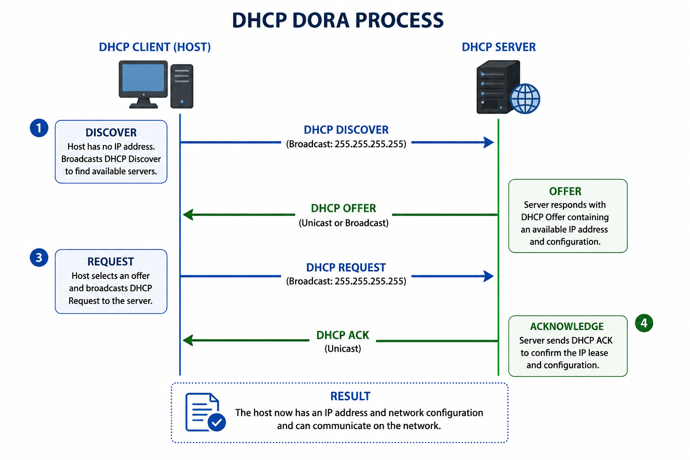

# DHCP Process (Dynamic Host Configuration Protocol)

## Introduction

Dynamic Host Configuration Protocol (DHCP) is a network protocol used to automatically assign IP configuration to devices.

Without DHCP, network administrators would have to manually assign:

- IP addresses
- Subnet masks
- Default gateways
- DNS servers

DHCP simplifies this process and allows devices to join networks quickly.

In cybersecurity and penetration testing, understanding DHCP is important for network reconnaissance, rogue DHCP attacks, and understanding how hosts obtain their configurations.

---

## What DHCP Does

When a device connects to a network, DHCP automatically provides:

- IP address
- Subnet mask
- Default gateway
- DNS server

Example:

```text
IP Address: 192.168.1.10
Subnet Mask: 255.255.255.0
Gateway: 192.168.1.1
DNS: 8.8.8.8
```

This allows the device to communicate properly.

---

## Why DHCP is Needed

Without DHCP:

- every device would need manual configuration
- IP conflicts would increase
- administration would become difficult

DHCP solves this by centralizing address assignment.

This is especially important in large networks.

---

## The DORA Process

DHCP follows a four-step process called:

```text
DORA
```

It stands for:

- Discover
- Offer
- Request
- Acknowledge

This is how a host obtains its network settings.

---

## Diagram: DHCP DORA Process



---

## Step 1: Discover

When a host joins a network, it does not have an IP address.

It sends a broadcast:

```text
DHCP Discover
```

Purpose:

```text
Find available DHCP servers
```

Destination:

```text
255.255.255.255
```

This reaches all devices on the LAN.

---

## Step 2: Offer

The DHCP server replies with:

```text
DHCP Offer
```

This includes:

- available IP address
- subnet mask
- gateway
- lease time

Example:

```text
192.168.1.10
```

This is an offered configuration.

---

## Step 3: Request

The host responds:

```text
DHCP Request
```

This tells the server:

```text
I accept this IP
```

This is also broadcast.

This informs other DHCP servers that their offers were rejected.

---

## Step 4: Acknowledge

The server sends:

```text
DHCP ACK
```

This confirms the lease.

Now the host can use the assigned configuration.

Communication can begin.

---

## DHCP Lease

DHCP addresses are leased for a period of time.

Example:

```text
24 hours
```

After half the lease expires:

the host attempts renewal.

If renewal fails:

the lease eventually expires.

The host must request again.

---

## Security Relevance

DHCP is important in penetration testing.

Examples:

- Rogue DHCP servers
- DHCP starvation attacks
- Fake gateway injection
- Traffic redirection

An attacker can issue malicious DHCP offers and redirect victim traffic.

This can enable Man-in-the-Middle attacks.

---

## Key Takeaways

- DHCP automatically assigns IP configurations.
- It reduces manual configuration.
- DHCP uses the DORA process.
- Leases are temporary.
- DHCP is essential for network access.

---

## Conclusion

DHCP is one of the most important protocols in networking because it automates host configuration.

Without DHCP, network administration would be slow and error-prone.

For penetration testers, understanding DHCP is important because attackers can abuse it for traffic interception and network manipulation.
