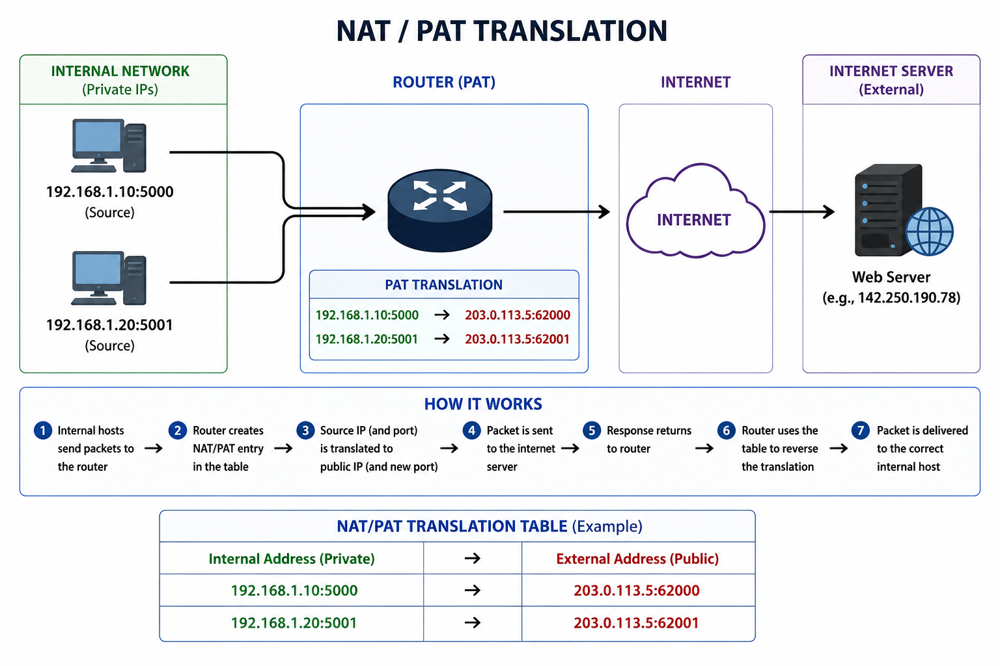

# NAT and PAT

## Introduction

Network Address Translation (NAT) is the process of translating private IP addresses into public IP addresses.

Port Address Translation (PAT) is an extension of NAT that allows multiple devices to share a single public IP by using different port numbers.

NAT and PAT are essential for internet communication because private IP addresses cannot be routed on the public internet.

In penetration testing, understanding NAT is important for reverse shells, port forwarding, and understanding external-to-internal communication.

---

## Why NAT is Needed

Private IP ranges such as:

```text
192.168.x.x
10.x.x.x
172.16.x.x – 172.31.x.x
```

are not routable on the internet.

If a host sends traffic directly using a private IP:

```text
192.168.1.10
```

internet routers will drop it.

A public IP is required.

This is where NAT comes in.

---

## What NAT Does

NAT changes:

```text
Private IP → Public IP
```

Example:

```text
192.168.1.10 → 203.0.113.5
```

This allows the host to communicate externally.

The router keeps track of the translation.

---

## What PAT Does

PAT extends NAT by translating:

```text
Private IP + Port → Public IP + New Port
```

Example:

```text
192.168.1.10:5000 → 203.0.113.5:62000
192.168.1.20:5001 → 203.0.113.5:62001
```

This allows multiple hosts to share one public IP.

PAT is the most common form of NAT today.

---

## NAT/PAT Process

The process:

1. Host sends packet to router
2. Router checks NAT table
3. Router creates translation
4. Source IP (and port) is changed
5. Packet is sent to the internet
6. Response returns to public IP
7. Router checks NAT table
8. Router reverses translation
9. Packet delivered internally

---

## Diagram: NAT/PAT Translation



---

## NAT Table Example

| Internal Address | External Address |
|---|---|
| 192.168.1.10:5000 | 203.0.113.5:62000 |
| 192.168.1.20:5001 | 203.0.113.5:62001 |

This table allows the router to track sessions.

Without this table:

responses cannot return correctly.

---

## Types of NAT

### Static NAT

One private IP maps to one public IP.

Example:

```text
192.168.1.10 ↔ 203.0.113.10
```

Used for servers.

---

### Dynamic NAT

Maps private IPs to a pool of public IPs.

Example:

```text
192.168.1.10 → 203.0.113.11
192.168.1.20 → 203.0.113.12
```

Less common.

---

### PAT

Multiple private IPs share one public IP using ports.

Most common in home and enterprise networks.

---

## Security Relevance

NAT is important in penetration testing.

Examples:

- Reverse shells rely on NAT traversal
- Port forwarding exposes internal services
- NAT can hide internal topology
- Firewall rules often depend on NAT

Understanding NAT helps explain why some internal systems are difficult to reach externally.

---

## Key Takeaways

- NAT translates private IPs into public IPs.
- PAT allows multiple devices to share one public IP.
- NAT tables track active sessions.
- Private IPs cannot reach the internet directly.
- PAT is the most common NAT method.

---

## Conclusion

NAT and PAT are essential for modern internet communication because they allow private networks to access public resources.

For penetration testers, understanding NAT is important for understanding external communication, reverse connections, and how internal systems are exposed.
