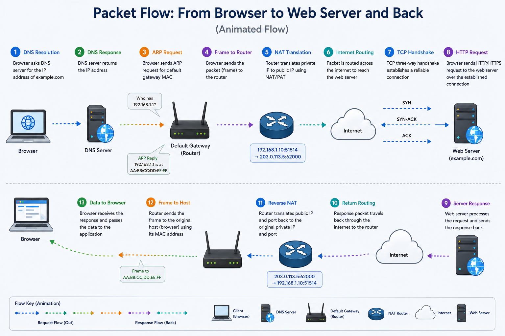

# Packet Flow: How Data Moves Across Networks

## Introduction

Understanding how data moves across a network is one of the most important foundations in networking and penetration testing.

When a user requests a website, multiple networking processes work together to establish communication, route packets, and deliver data.

This process includes:

- DNS resolution
- ARP resolution
- Default gateway forwarding
- NAT translation
- Routing
- TCP handshake
- HTTP/HTTPS communication

Understanding this flow helps explain how systems communicate and where attacks or analysis can take place.

---

## Packet Flow Overview

When a user enters a domain name into a browser, the following process takes place:

1. Domain name resolution (DNS)
2. Local network destination check
3. ARP request for default gateway MAC address
4. Packet forwarding to the router
5. NAT/PAT translation
6. Internet routing
7. TCP three-way handshake
8. HTTP/HTTPS request
9. Server response
10. Reverse NAT translation
11. Delivery back to the host

---

## Diagram: Full Packet Flow



---

## Step 1: DNS Resolution

The browser first needs to know the IP address of the domain.

Example:

```text
google.com → 142.250.190.78
```

DNS resolves the domain name into an IP address.

Without DNS, communication cannot begin.

---

## Step 2: Local Network Check

The host checks whether the destination IP belongs to its local subnet.

This is done using:

- IP address
- Subnet mask

If the destination is outside the local network:

The packet must be forwarded to the default gateway.

Example:

```text
Host IP: 192.168.1.10
Destination IP: 142.250.190.78
```

Since they are not in the same subnet, forwarding is required.

---

## Step 3: ARP Resolution

Before sending the packet to the router, the host must know the MAC address of the default gateway.

The host sends:

```text
Who has 192.168.1.1?
```

The router replies with its MAC address.

This allows frame delivery within the local network.

Important:

ARP resolves the **next-hop MAC**, not the destination website MAC.

---

## Step 4: Forwarding to the Default Gateway

The host builds the frame:

```text
Source MAC: Host MAC
Destination MAC: Router MAC
Source IP: Host IP
Destination IP: Website IP
```

The router receives the packet.

---

## Step 5: NAT/PAT Translation

Since private IP addresses cannot travel on the internet, the router translates the source IP.

Example:

```text
192.168.1.10 → 203.0.113.5
```

With PAT:

```text
192.168.1.10:5000 → 203.0.113.5:62000
```

This allows multiple internal hosts to share one public IP.

---

## Step 6: Internet Routing

The packet travels through multiple routers across the internet.

Routers forward packets based on:

- Routing tables
- Destination IP

Each router determines the next hop until the packet reaches the destination server.

---

## Step 7: TCP Three-Way Handshake

Before data transfer begins, TCP establishes a connection.

The process:

1. SYN
2. SYN-ACK
3. ACK

This creates a reliable communication session.

---

## Step 8: HTTP/HTTPS Request

After the TCP connection is established:

The browser sends:

- HTTP request
or
- HTTPS request

This contains:

- Method (GET, POST)
- Headers
- Requested resource

Example:

```text
GET /index.html HTTP/1.1
```

---

## Step 9: Server Response

The server processes the request and sends the response back.

The response travels to:

```text
203.0.113.5
```

which is the router’s public IP.

---

## Step 10: Reverse NAT Translation

The router checks its NAT table and translates:

```text
203.0.113.5:62000 → 192.168.1.10:5000
```

This ensures the correct internal host receives the response.

---

## Step 11: Data Delivery to the Host

The host receives the packet, removes all headers, and passes the data to the browser.

The browser then renders the webpage.

This completes the communication process.

---

## Security Relevance

Understanding packet flow is critical in penetration testing.

Examples:

- DNS → reconnaissance
- ARP → spoofing attacks
- Routing → pivoting
- TCP → port scanning
- HTTP → web exploitation
- NAT → reverse shell behavior

This helps security professionals understand where attacks occur and how traffic can be analyzed.

---

## Key Takeaways

- DNS resolves names into IP addresses.
- ARP resolves the gateway MAC address.
- Default gateways forward external traffic.
- NAT translates private addresses into public addresses.
- TCP establishes reliable connections.
- HTTP/HTTPS handles web communication.

These processes form the foundation of most network communication.

---

## Conclusion

Packet flow explains how data moves from a local host to a remote server and back.

Understanding this process is essential for networking, troubleshooting, and penetration testing because it reveals how communication is established and where vulnerabilities may exist.
