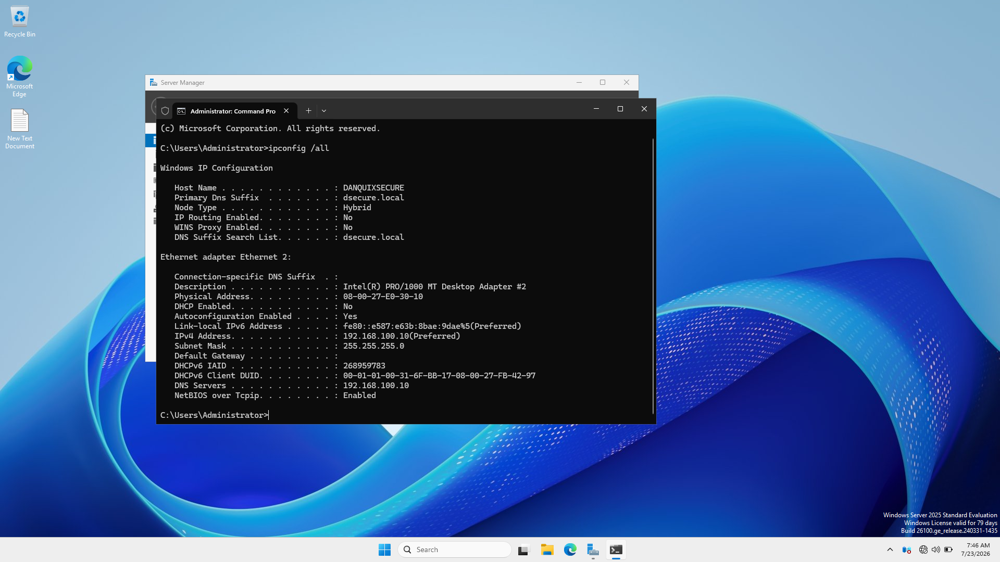
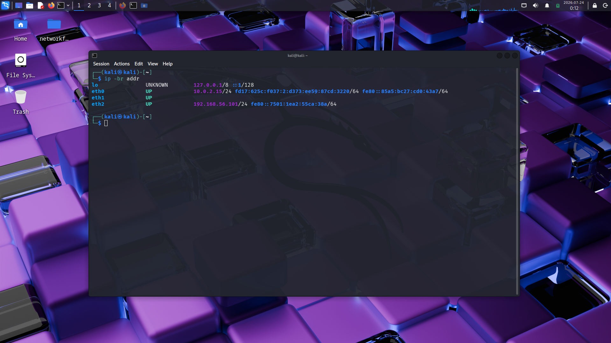
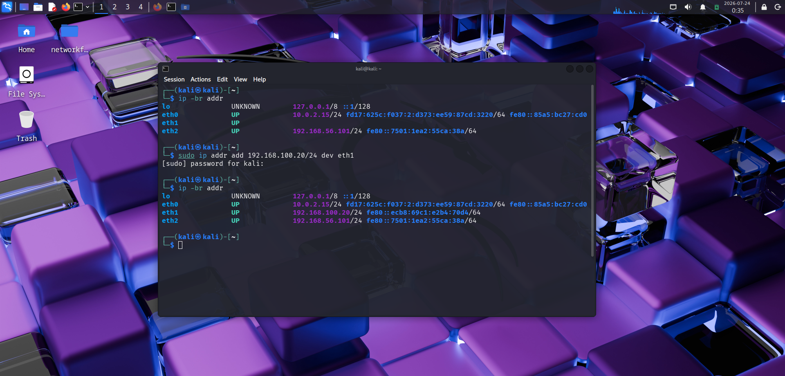
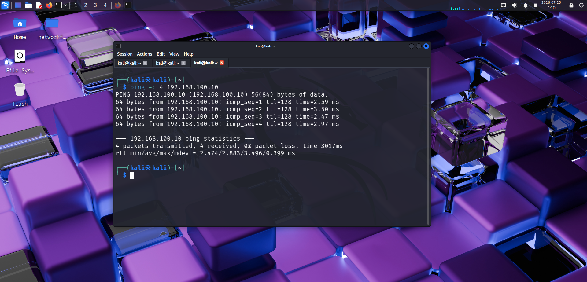

# Technical Investigation Report
# Technical Investigation Report

## Phase 1: Windows Server 2025 Network Configuration

### Objective

The first stage of this project involved configuring the Windows Server 2025 virtual machine with a static IPv4 address on the isolated VirtualBox internal network named `intnet`.

A static IPv4 address was selected because the server will later provide network services to other systems within the laboratory network. A predictable address is therefore necessary so that client systems can reliably locate the server.

---

### Initial Network State

Before the static configuration was applied, the Windows Server 2025 network adapter was configured to obtain an IPv4 address automatically through DHCP.

However, the `intnet` network did not yet have an operational DHCP server. Consequently, the server was unable to obtain a normal IPv4 address from a DHCP service.

Windows automatically assigned the adapter an address from the Automatic Private IP Addressing (APIPA) range:

```text
IPv4 Address: 169.254.74.241
Subnet Mask: 255.255.0.0
```

The relevant initial configuration was:

```text
DHCP Enabled: Yes
IPv4 Address: 169.254.74.241
Default Gateway: None
```

An address in the `169.254.0.0/16` range indicates that the host was unable to obtain an IPv4 address from a DHCP server and automatically assigned itself an address for limited local communication.

At this stage, the isolated internal network did not have an operational IPv4 DHCP service.

---

### Static IPv4 Configuration

The Windows Server 2025 network interface was subsequently configured with a static IPv4 address:

```text
IPv4 Address: 192.168.100.10
Subnet Mask: 255.255.255.0
Default Gateway: None
DNS Server: 192.168.100.10
```

This places the server on the following IPv4 network:

```text
Network: 192.168.100.0/24
Server:  192.168.100.10/24
```

The resulting configuration was verified using:

```cmd
ipconfig /all
```

The verification output is shown below.



The configuration confirms that:

* DHCP is disabled.
* The server has the static IPv4 address `192.168.100.10`.
* The subnet mask is `255.255.255.0`.
* No default gateway is currently configured.
* The server is configured to use `192.168.100.10` as its DNS server.

---

### Reason for Using a Static IP Address

The server is intended to provide network services to other systems within the laboratory network.

A dynamically changing address would make it difficult for client systems to reliably locate the server. Assigning a static address therefore establishes a predictable endpoint for future services.

The current logical configuration is:

```text
Windows Server 2025
        │
        │ 192.168.100.10/24
        │
        ▼
Internal Network: intnet
```

---

### Current State

At the end of this phase, the Windows Server 2025 virtual machine has been configured with a static IPv4 address on the isolated `intnet` network.

```text
IPv4 Address: 192.168.100.10
Subnet Mask: 255.255.255.0
DHCP: Disabled
Default Gateway: None
DNS Server: 192.168.100.10
```

This configuration establishes the server as a predictable host on the laboratory network.

The next phase will involve configuring the Kali Linux interface connected to `intnet` with a temporary static IPv4 address in the same subnet. This will allow connectivity and ARP resolution to be tested before DHCP services are introduced.


## Phase 2: Kali Linux Network Configuration and Connectivity Validation

### Initial Network State

Before configuration, the Kali Linux virtual machine had three network interfaces:

```text
eth0 → 10.0.2.15/24
eth1 → No IPv4 address
eth2 → 192.168.56.101/24
```

The VirtualBox adapter configuration was:

```text
Adapter 1 → NAT
Adapter 2 → Internal Network: intnet
Adapter 3 → Host-Only Adapter
```

Based on this mapping, `eth1` was identified as the interface connected to the isolated `intnet` network.

The initial state of the Kali network interfaces was captured in:



---

### Temporary Static IPv4 Configuration

To establish communication with the Windows Server before introducing DHCP, a temporary static IPv4 address was assigned to Kali's `eth1` interface:

```bash
sudo ip addr add 192.168.100.20/24 dev eth1
```

The resulting configuration was:

```text
Kali eth1:
IPv4 Address: 192.168.100.20
Subnet Mask: 255.255.255.0
```

The Windows Server was configured as:

```text
IPv4 Address: 192.168.100.10
Subnet Mask: 255.255.255.0
```

Both systems therefore belonged to:

```text
192.168.100.0/24
```

The final Kali interface state was verified using:

```bash
ip -br addr
```

The result confirmed:

```text
eth1 → 192.168.100.20/24
```



---

### Connectivity Test

After assigning the temporary static IPv4 address, connectivity between Kali and the Windows Server was tested using:

```bash
ping -c 4 192.168.100.10
```

The test produced:

```text
4 packets transmitted
4 packets received
0% packet loss
```

This confirmed successful communication between the two virtual machines across the isolated `intnet` network.



---

### Technical Interpretation

The successful connectivity test demonstrates that:

1. The Kali `eth1` interface is connected to the correct VirtualBox Internal Network.
2. The Windows Server network interface is connected to the same `intnet` network.
3. Both hosts have valid IPv4 addresses within the same `/24` subnet.
4. The hosts can resolve each other's Layer 2 addresses through ARP.
5. ICMP Echo Requests and Echo Replies successfully traverse the virtual network.
6. Communication between the two systems does not require Internet access or a default gateway because both hosts are on the same local subnet.

The communication path is therefore:

```text
Kali Linux
192.168.100.20/24
       │
       │ Internal Network: intnet
       │
Windows Server 2025
192.168.100.10/24
```

---

### Troubleshooting Observation

The first connectivity test did not produce a response because the temporary IPv4 address assigned to Kali's `eth1` interface was no longer present.

The interface was subsequently re-verified using:

```bash
ip -br addr
```

The missing IPv4 configuration was identified, the address was reapplied, and connectivity was tested again.

The successful result was:

```text
4 packets transmitted
4 packets received
0% packet loss
```

This demonstrated the importance of verifying the current system state before troubleshooting higher-level connectivity problems.

---

### Phase 2 Conclusion

The initial network configuration and connectivity validation were successfully completed.

The Windows Server and Kali Linux systems can now communicate across the isolated `intnet` network using manually configured IPv4 addresses.

The next stage will introduce DHCP services on the Windows Server. Once DHCP is configured, Kali's `eth1` interface can be changed from a temporary static configuration to DHCP and tested for automatic IPv4 address assignment.
