# Technical Investigation Report

## Phase 1: Windows Server 2025 Network Configuration

### Objective

The first stage of this project involved configuring the Windows Server 2025 virtual machine with a static IPv4 address on the isolated VirtualBox internal network named `intnet`.

A static IPv4 address was selected because the server will later provide network services to other systems within the laboratory network. A predictable address is therefore necessary so that client systems can reliably locate the server.

---

### Initial Network State

Before the static configuration was applied, the Windows Server 2025 network adapter was configured to obtain an IPv4 address automatically through DHCP.

However, the `intnet` network did not yet have an operational DHCP server. Consequently, the server was unable to obtain a normal IPv4 address from a DHCP service.

Windows automatically assigned the adapter an address from the Automatic Private IP Addressing (APIPA) range:

```text
IPv4 Address: 169.254.74.241
Subnet Mask: 255.255.0.0
```

The relevant initial configuration was:

```text
DHCP Enabled: Yes
IPv4 Address: 169.254.74.241
Default Gateway: None
```

An address in the `169.254.0.0/16` range indicates that the host was unable to obtain an IPv4 address from a DHCP server and automatically assigned itself an address for limited local communication.

At this stage, the isolated internal network did not have an operational IPv4 DHCP service.

---

### Static IPv4 Configuration

The Windows Server 2025 network interface was subsequently configured with a static IPv4 address:

```text
IPv4 Address: 192.168.100.10
Subnet Mask: 255.255.255.0
Default Gateway: None
DNS Server: 192.168.100.10
```

This places the server on the following IPv4 network:

```text
Network: 192.168.100.0/24
Server:  192.168.100.10/24
```

The resulting configuration was verified using:

```cmd
ipconfig /all
```

The verification output is shown below.

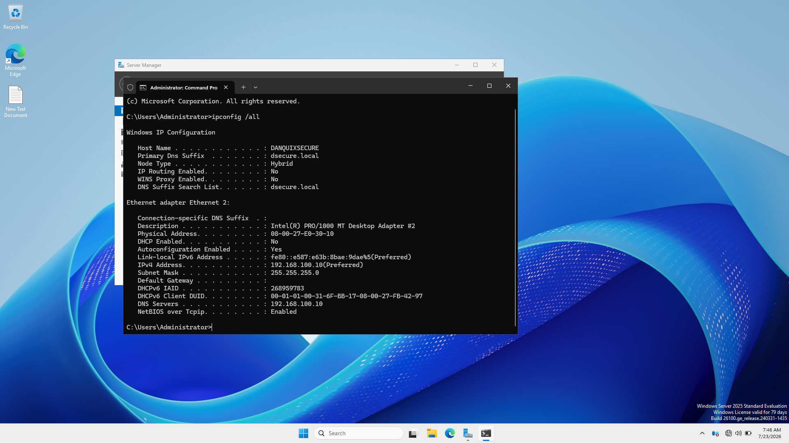

The configuration confirms that:

* DHCP is disabled.
* The server has the static IPv4 address `192.168.100.10`.
* The subnet mask is `255.255.255.0`.
* No default gateway is currently configured.
* The server is configured to use `192.168.100.10` as its DNS server.

---

### Reason for Using a Static IP Address

The server is intended to provide network services to other systems within the laboratory network.

A dynamically changing address would make it difficult for client systems to reliably locate the server. Assigning a static address therefore establishes a predictable endpoint for future services.

The current logical configuration is:

```text
Windows Server 2025
        │
        │ 192.168.100.10/24
        │
        ▼
Internal Network: intnet
```

---

### Current State

At the end of this phase, the Windows Server 2025 virtual machine has been configured with a static IPv4 address on the isolated `intnet` network.

```text
IPv4 Address: 192.168.100.10
Subnet Mask: 255.255.255.0
DHCP: Disabled
Default Gateway: None
DNS Server: 192.168.100.10
```

This configuration establishes the server as a predictable host on the laboratory network.

The next phase will involve configuring the Kali Linux interface connected to `intnet` with a temporary static IPv4 address in the same subnet. This will allow connectivity and ARP resolution to be tested before DHCP services are introduced.


## Phase 2: Kali Linux Network Configuration and Connectivity Validation

### Initial Network State

Before configuration, the Kali Linux virtual machine had three network interfaces:

```text
eth0 → 10.0.2.15/24
eth1 → No IPv4 address
eth2 → 192.168.56.101/24
```

The VirtualBox adapter configuration was:

```text
Adapter 1 → NAT
Adapter 2 → Internal Network: intnet
Adapter 3 → Host-Only Adapter
```

Based on this mapping, `eth1` was identified as the interface connected to the isolated `intnet` network.

The initial state of the Kali network interfaces was captured in:

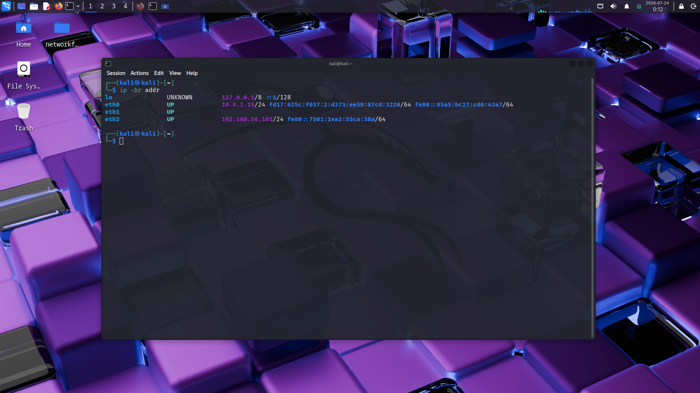

---

### Temporary Static IPv4 Configuration

To establish communication with the Windows Server before introducing DHCP, a temporary static IPv4 address was assigned to Kali's `eth1` interface:

```bash
sudo ip addr add 192.168.100.20/24 dev eth1
```

The resulting configuration was:

```text
Kali eth1:
IPv4 Address: 192.168.100.20
Subnet Mask: 255.255.255.0
```

The Windows Server was configured as:

```text
IPv4 Address: 192.168.100.10
Subnet Mask: 255.255.255.0
```

Both systems therefore belonged to:

```text
192.168.100.0/24
```

The final Kali interface state was verified using:

```bash
ip -br addr
```

The result confirmed:

```text
eth1 → 192.168.100.20/24
```

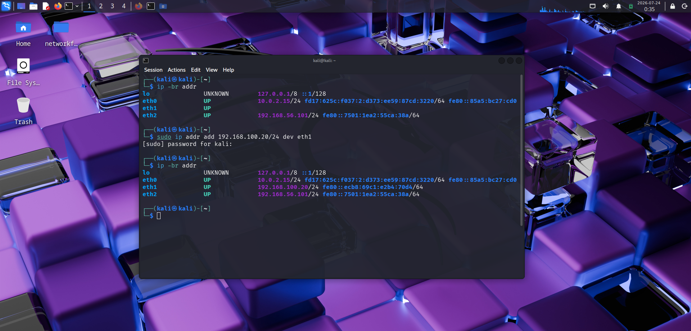

---

### Connectivity Test

After assigning the temporary static IPv4 address, connectivity between Kali and the Windows Server was tested using:

```bash
ping -c 4 192.168.100.10
```

The test produced:

```text
4 packets transmitted
4 packets received
0% packet loss
```

This confirmed successful communication between the two virtual machines across the isolated `intnet` network.

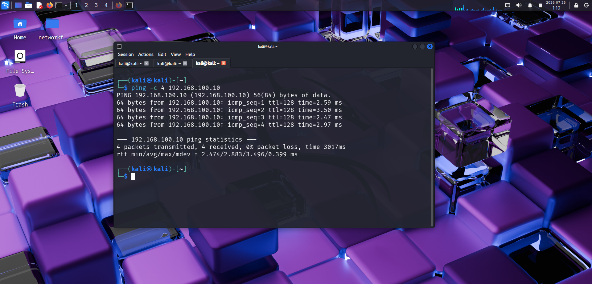

---

### Technical Interpretation

The successful connectivity test demonstrates that:

1. The Kali `eth1` interface is connected to the correct VirtualBox Internal Network.
2. The Windows Server network interface is connected to the same `intnet` network.
3. Both hosts have valid IPv4 addresses within the same `/24` subnet.
4. The hosts can resolve each other's Layer 2 addresses through ARP.
5. ICMP Echo Requests and Echo Replies successfully traverse the virtual network.
6. Communication between the two systems does not require Internet access or a default gateway because both hosts are on the same local subnet.

The communication path is therefore:

```text
Kali Linux
192.168.100.20/24
       │
       │ Internal Network: intnet
       │
Windows Server 2025
192.168.100.10/24
```

---

### Troubleshooting Observation

The first connectivity test did not produce a response because the temporary IPv4 address assigned to Kali's `eth1` interface was no longer present.

The interface was subsequently re-verified using:

```bash
ip -br addr
```

The missing IPv4 configuration was identified, the address was reapplied, and connectivity was tested again.

The successful result was:

```text
4 packets transmitted
4 packets received
0% packet loss
```

This demonstrated the importance of verifying the current system state before troubleshooting higher-level connectivity problems.

---

### Phase 2 Conclusion

The initial network configuration and connectivity validation were successfully completed.

The Windows Server and Kali Linux systems can now communicate across the isolated `intnet` network using manually configured IPv4 addresses.

The next stage will introduce DHCP services on the Windows Server. Once DHCP is configured, Kali's `eth1` interface can be changed from a temporary static configuration to DHCP and tested for automatic IPv4 address assignment.

# Phase 3: DHCP Server Deployment and Dynamic IPv4 Address Assignment

## Objective

Following the successful validation of communication using manually configured IPv4 addresses, the next stage of the investigation involved introducing Dynamic Host Configuration Protocol (DHCP) services into the isolated laboratory network.

The objective of this phase was to configure the Windows Server 2025 virtual machine as the DHCP server for the **192.168.100.0/24** network and verify that client systems could automatically obtain valid IPv4 configuration information without requiring manual configuration.

Successful completion of this phase would demonstrate the transition from manual host configuration to centralized network administration, where IPv4 addresses are dynamically assigned and managed by the server.

---

## Initial Network State

At the end of Phase 2, communication between the Windows Server and Kali Linux had already been successfully established using manually configured IPv4 addresses.

The systems were configured as follows:

**Windows Server 2025**

- IPv4 Address: **192.168.100.10**
- Subnet Mask: **255.255.255.0**

**Kali Linux**

- IPv4 Address: **192.168.100.20**
- Subnet Mask: **255.255.255.0**

Connectivity testing confirmed successful communication between both hosts across the isolated **intnet** network.

Although the network was fully operational, IPv4 configuration still required manual assignment on every client. This approach is not practical for enterprise environments where multiple hosts require centralized and automated network configuration.

The next step therefore involved deploying a DHCP server capable of automatically distributing IPv4 addressing information to client systems.

---

## DHCP Server Installation

The DHCP Server role was installed on the Windows Server 2025 virtual machine using the **Add Roles and Features Wizard** available through Server Manager.

Following installation, the DHCP Post-Installation Configuration Wizard was completed to authorize the DHCP server within the Active Directory domain.

Authorization is required because the server operates as a Domain Controller. Windows prevents unauthorized DHCP servers from distributing IPv4 addresses within an Active Directory environment to protect clients from receiving configuration information from rogue DHCP servers.

Once authorization was completed successfully, the DHCP service became available for scope configuration.

---

## DHCP Scope Configuration

A new IPv4 scope was created to provide dynamic IPv4 addressing for hosts connected to the isolated **intnet** network.

The scope was configured using the following parameters:

| Parameter | Value |
|-----------|-------|
| Scope Name | Internal Network |
| Network | 192.168.100.0/24 |
| Start Address | 192.168.100.100 |
| End Address | 192.168.100.200 |
| Subnet Mask | 255.255.255.0 |
| Lease Duration | Default |
| Router (Option 003) | None |
| DNS Server (Option 006) | 192.168.100.10 |
| DNS Domain (Option 015) | dsecure.local |

After configuration, the scope was activated, allowing the DHCP service to begin responding to client requests.

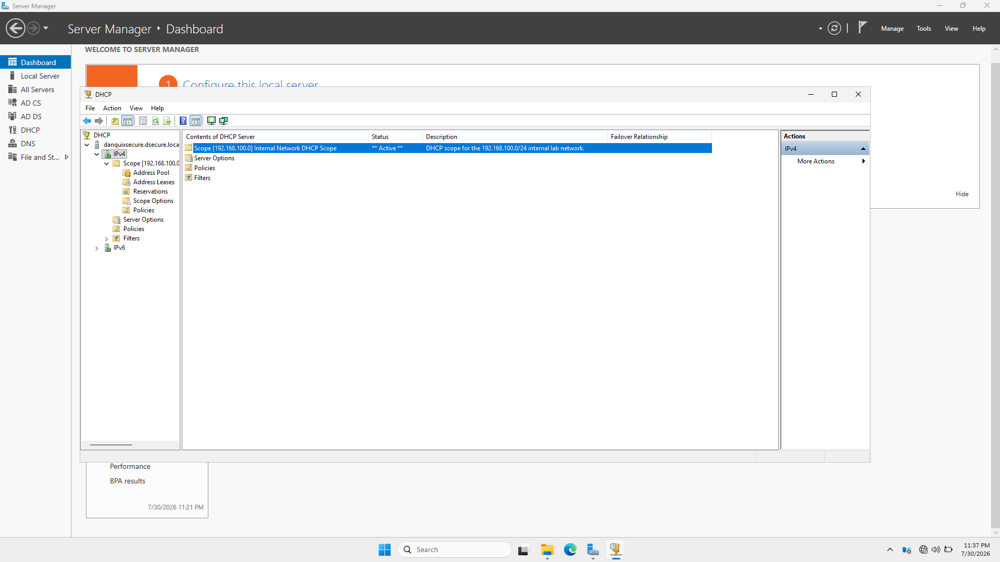

---

## Client Transition from Static Configuration to DHCP

Before requesting a DHCP lease, the temporary static IPv4 configuration previously assigned to Kali Linux was removed.

The temporary address:

**192.168.100.20/24**

was deleted from the **eth1** interface.

The DHCP client package (**isc-dhcp-client**) was then installed to allow Kali Linux to communicate with the Windows DHCP server.

A DHCP request was initiated using:

```bash
sudo dhclient -v eth1
```

This command broadcasts a **DHCPDISCOVER** message requesting IPv4 configuration from any available DHCP server on the local subnet.

---

## Troubleshooting Investigation

The initial DHCP request did not produce a successful response.

Instead, repeated **DHCPDISCOVER** messages were transmitted without receiving a corresponding **DHCPOFFER** from the Windows Server.

Investigation initially focused on verifying:

- Physical connectivity between both virtual machines.
- Correct VirtualBox Internal Network configuration.
- DHCP Server installation.
- Scope activation.
- DHCP Client operation on Kali Linux.

Since all configuration appeared correct, Windows Event Viewer was examined to determine why the DHCP server was not responding.

The investigation revealed that although the DHCP role had been installed, the DHCP service had not yet been properly authorized within Active Directory.

As a result, Windows prevented the DHCP server from servicing client requests.

Once authorization was completed and the DHCP service restarted, the server immediately became capable of leasing IPv4 addresses to clients.

---

## DHCP Lease Verification

Following successful authorization, Kali Linux again requested an IPv4 address using:

```bash
sudo dhclient -v eth1
```

This time, the Windows Server responded successfully with:

- DHCPDISCOVER
- DHCPOFFER
- DHCPREQUEST
- DHCPACK

The client was dynamically assigned the following IPv4 address:

**192.168.100.100/24**

The successful lease acquisition is shown below.

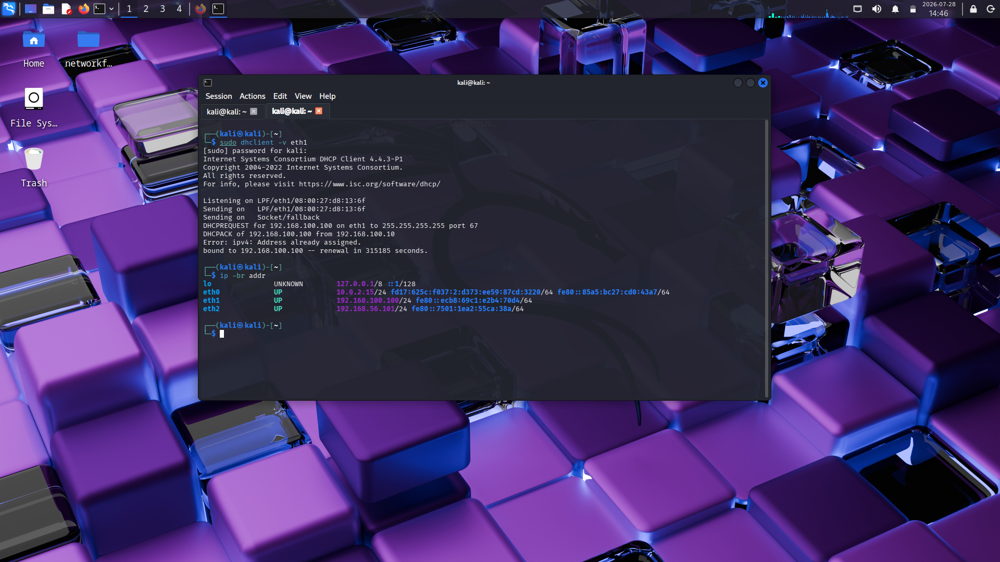

The Windows DHCP console simultaneously recorded the active lease.

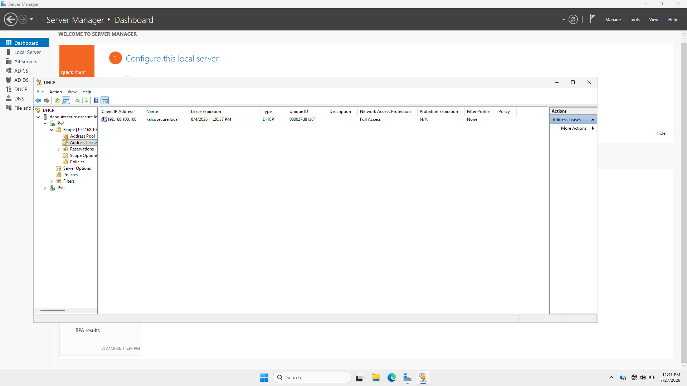

---

## Connectivity Verification

After receiving the dynamically assigned IPv4 address, connectivity between Kali Linux and the Windows Server was tested once again using ICMP.

The verification command executed was:

```bash
ping -c 4 192.168.100.10
```

The results confirmed:

- 4 packets transmitted.
- 4 packets received.
- 0% packet loss.

Successful communication demonstrated that the dynamically assigned IPv4 address functioned correctly within the isolated laboratory network.

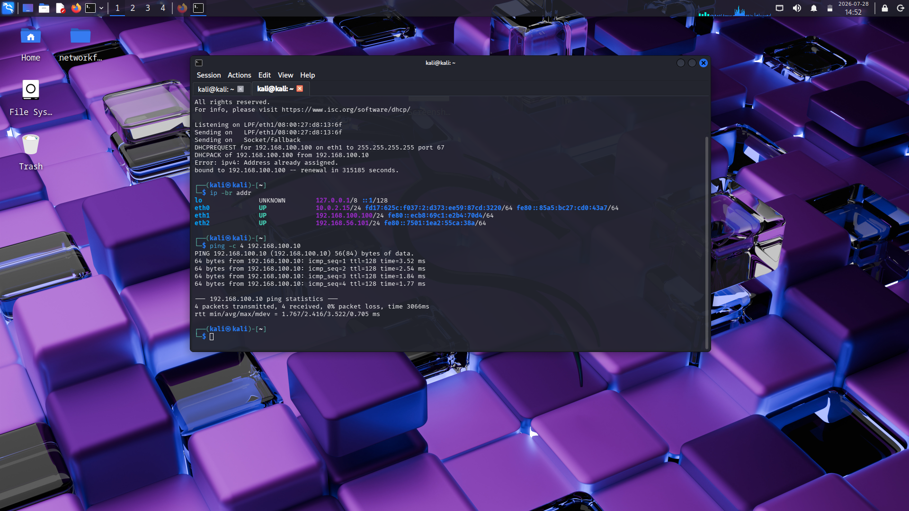

---

## Technical Interpretation

This phase demonstrates the complete lifecycle of DHCP deployment within an enterprise-style Windows Server environment.

Rather than manually configuring IPv4 addresses on every host, the Windows Server now performs centralized IPv4 address allocation for clients connected to the **192.168.100.0/24** network.

The successful lease process confirmed the correct operation of the standard DHCP exchange:

- DHCPDISCOVER
- DHCPOFFER
- DHCPREQUEST
- DHCPACK

The investigation also demonstrated the importance of DHCP authorization within Active Directory environments, where Windows prevents unauthorized DHCP servers from distributing network configuration information.

The resulting communication path is therefore:

Kali Linux
(Dynamic IPv4 Address)
192.168.100.100/24
        │
        │ DHCP Lease
        │
Windows Server 2025
DHCP Server
192.168.100.10/24

---

## Phase 3 Conclusion

The Windows Server 2025 virtual machine has been successfully configured as the DHCP server for the isolated laboratory network.

Kali Linux successfully transitioned from a manually configured IPv4 address to a dynamically assigned DHCP lease while maintaining reliable communication with the Windows Server.

The laboratory network now supports centralized IPv4 address management, providing a foundation for additional enterprise network services.

The next phase will focus on configuring Domain Name System (DNS) services and verifying hostname resolution within the isolated network.

# Phase 4: Domain Name System (DNS) Configuration and Name Resolution Verification

## Objective

Following the successful deployment of DHCP services, the next stage of the investigation focused on implementing and validating Domain Name System (DNS) services within the isolated laboratory network.

The objective of this phase was to verify that the Windows Server 2025 virtual machine could successfully provide DNS services for the **dsecure.local** domain and confirm that client systems could resolve hostnames into IPv4 addresses without requiring manual IP address references.

Successful completion of this phase would demonstrate the integration of DHCP and DNS services, allowing client systems to automatically receive DNS configuration and communicate using hostnames instead of numerical IPv4 addresses.

---

## Initial Network State

At the conclusion of Phase 3, Kali Linux had successfully obtained its IPv4 configuration dynamically from the Windows DHCP server.

The resulting network configuration was:

**Windows Server 2025**

- IPv4 Address: **192.168.100.10**
- DNS Server: **192.168.100.10**

**Kali Linux**

- IPv4 Address: **192.168.100.100**
- DNS Server: **192.168.100.10**
- DNS Search Domain: **dsecure.local**

The DHCP lease successfully distributed both the DNS server address and the Active Directory DNS search domain to the client.

The next stage therefore focused on validating that hostname resolution functioned correctly across the isolated network.

---

## DNS Zone Verification

The DNS Manager console was opened through **Server Manager** to verify that the Active Directory DNS zone had been created correctly.

The Forward Lookup Zones contained the following domain:

**dsecure.local**

Within this zone, a Host (A) resource record existed for the Windows Server.

Hostname:

**danquixsecure**

IPv4 Address:

**192.168.100.10**

The presence of this resource record confirms that the Windows Server is registered within the Active Directory integrated DNS zone and can be resolved by DNS clients.

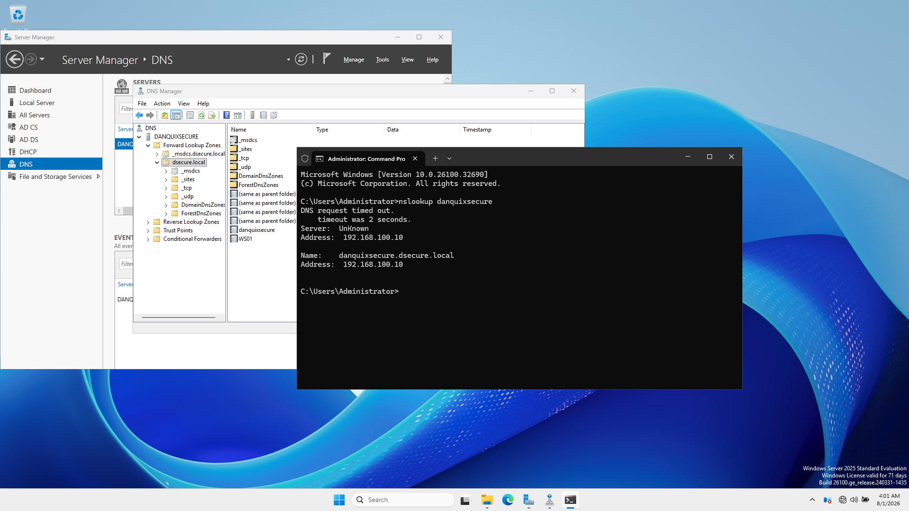

---

## Windows Server DNS Verification

DNS functionality was first verified directly from the Windows Server using the **nslookup** utility.

The following command was executed:

```cmd
nslookup danquixsecure
```

The result successfully resolved:

**danquixsecure.dsecure.local**

to

**192.168.100.10**

Although the command reported the DNS server as **Unknown**, the forward lookup completed successfully. This behaviour occurs because a Reverse Lookup Zone had not yet been configured for the laboratory network.

The successful forward lookup confirms that the Windows DNS service is operating correctly.

---

## Client DNS Resolution Verification

DNS functionality was subsequently verified from the Kali Linux client.

The current DNS configuration was examined and confirmed that DHCP had automatically supplied:

- DNS Server: **192.168.100.10**
- DNS Search Domain: **dsecure.local**

Kali Linux then queried the Windows DNS server using:

```bash
nslookup danquixsecure.dsecure.local 192.168.100.10
```

The query successfully returned:

**192.168.100.10**

This demonstrated that the Windows Server correctly resolved Fully Qualified Domain Names (FQDNs) for clients connected to the isolated laboratory network.

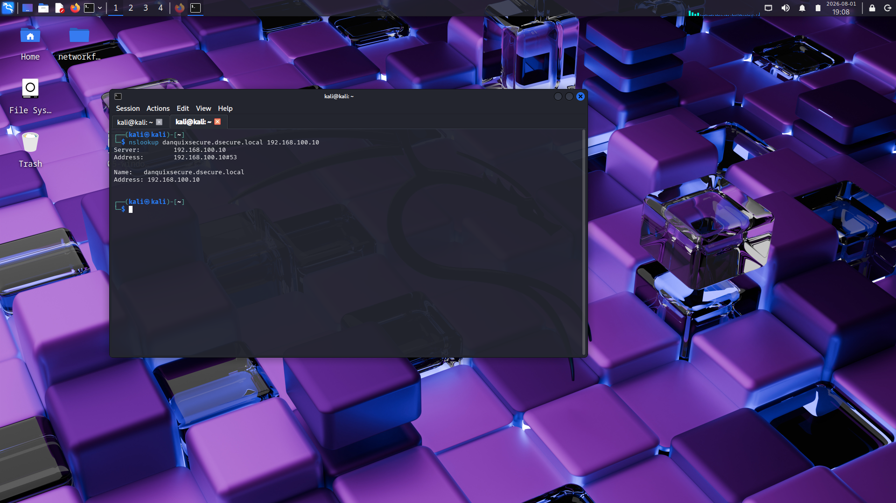

---

## Hostname Connectivity Verification

The final verification step confirmed that client applications could successfully use DNS rather than manually specified IPv4 addresses.

Kali Linux executed:

```bash
ping -c 4 danquixsecure.dsecure.local
```

Instead of requiring the server's numerical IPv4 address, the hostname was successfully resolved by DNS before ICMP communication began.

The results confirmed:

- Hostname successfully resolved.
- IPv4 Address: **192.168.100.10**
- 4 packets transmitted.
- 4 packets received.
- 0% packet loss.

This demonstrates successful integration between DHCP, DNS and client name resolution services.

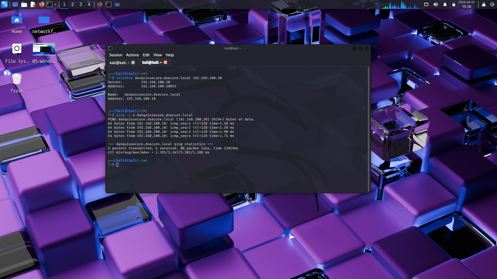

---

## Technical Interpretation

This phase demonstrates the successful deployment and verification of Domain Name System services within the isolated Active Directory laboratory environment.

The Windows Server now performs two critical infrastructure roles:

- Dynamic Host Configuration Protocol (DHCP)
- Domain Name System (DNS)

Rather than relying on manually remembered IPv4 addresses, client systems can communicate using meaningful hostnames. DHCP automatically distributes the DNS server configuration while DNS translates hostnames into their corresponding IPv4 addresses.

The successful resolution of **danquixsecure.dsecure.local** confirms that Active Directory integrated DNS is functioning correctly and that clients can locate network resources using standard enterprise name resolution.

The communication process is therefore:

Kali Linux

Hostname Request

**danquixsecure.dsecure.local**

↓

Windows DNS Server

**192.168.100.10**

↓

Hostname resolved to IPv4 Address

↓

ICMP communication established

---

## Phase 4 Conclusion

The Windows Server 2025 virtual machine has been successfully validated as the Domain Name System (DNS) server for the isolated laboratory network.

Kali Linux automatically received DNS configuration through DHCP and successfully resolved the server hostname using the Windows DNS service.

This phase completes the deployment of the core network infrastructure services required for enterprise communication, providing centralized IPv4 addressing through DHCP and centralized hostname resolution through DNS.

The next phase will investigate the Address Resolution Protocol (ARP) to examine how IPv4 communication is translated into Layer 2 Ethernet communication before packets are transmitted across the local network.

# Phase 5: Address Resolution Protocol (ARP) Investigation

## Objective

Following the successful deployment of DHCP and DNS services, the next stage of the investigation focused on understanding how communication occurs at the Data Link Layer before IPv4 packets are transmitted across the local network.

The objective of this phase was to examine the operation of the Address Resolution Protocol (ARP), observe the exchange of ARP Request and ARP Reply messages, and verify how Kali Linux dynamically learned the MAC address of the Windows Server before transmitting ICMP packets.

Successful completion of this phase would demonstrate how Layer 3 IPv4 communication depends on Layer 2 Ethernet addressing within a local area network.

---

## Initial ARP Cache State

Before generating any network traffic, the ARP cache on Kali Linux was cleared to ensure that no previously learned MAC addresses would influence the investigation.

The following command was executed:

```bash
sudo ip neigh flush dev eth1
```

The ARP table was then examined using:

```bash
ip neigh
```

The output confirmed that no ARP entry existed for the Windows Server (**192.168.100.10**) on the **eth1** interface.

This ensured that the next communication attempt would require a fresh ARP resolution process.

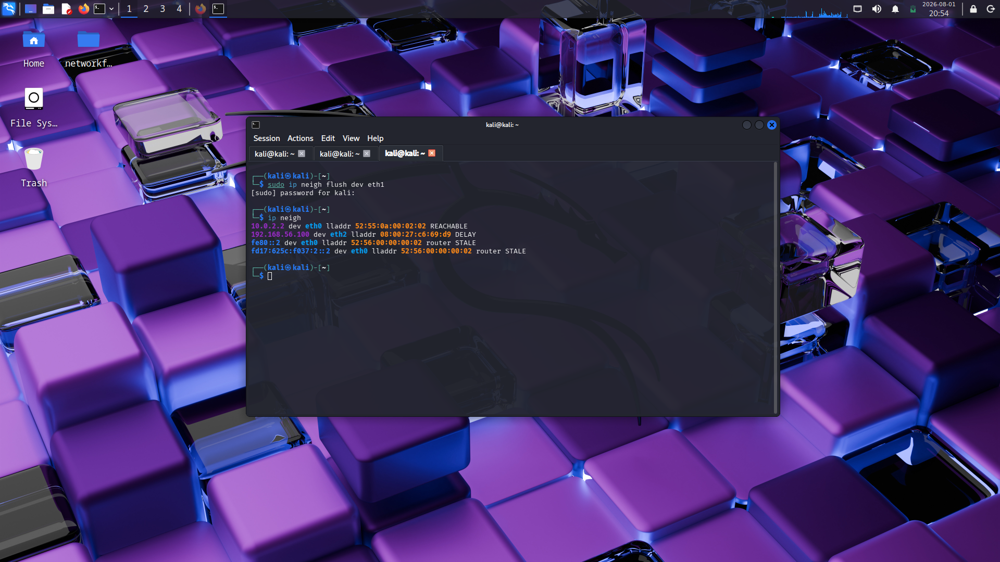

---

## Capturing ARP Traffic

Wireshark was started on the **eth1** interface to capture Layer 2 communication occurring on the isolated **intnet** network.

To trigger ARP activity, Kali Linux attempted to contact the Windows Server using:

```bash
ping -c 1 192.168.100.10
```

Because Kali knew the destination IPv4 address but did not yet know the corresponding Ethernet MAC address, it could not immediately transmit the ICMP Echo Request.

Instead, the operating system first initiated the Address Resolution Protocol.

---

## ARP Request and Reply Analysis

Wireshark captured the complete ARP exchange between both systems.

The first frame observed was an **ARP Request** transmitted by Kali Linux:

> Who has **192.168.100.10**? Tell **192.168.100.100**

Because Ethernet broadcasts are used during ARP discovery, this request was sent to every device on the local subnet.

The Windows Server recognized that the requested IPv4 address belonged to its own network interface and immediately responded with an **ARP Reply**:

> 192.168.100.10 is at **08:00:27:e0:30:10**

The capture also showed the reverse ARP exchange, where the Windows Server learned the MAC address of the Kali Linux client.

This mutual exchange allows both hosts to communicate directly using Ethernet frames.

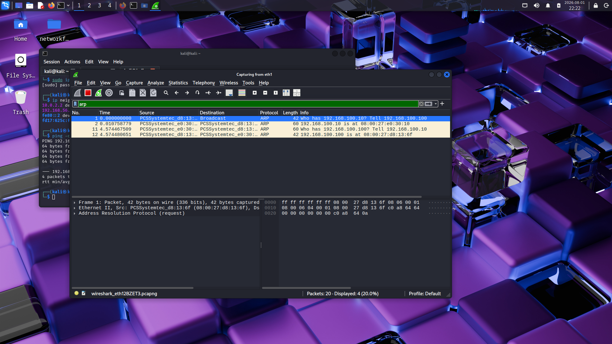

---

## ARP Cache Verification

Following the successful ARP exchange, the ARP cache on Kali Linux was examined once again using:

```bash
ip neigh
```

The output now contained a dynamically learned entry:

- IPv4 Address: **192.168.100.10**
- Interface: **eth1**
- MAC Address: **08:00:27:e0:30:10**
- State: **STALE**

The presence of this entry confirms that Kali Linux successfully resolved the Windows Server's Ethernet address.

The **STALE** state indicates that the entry remains valid but has not been used recently. Linux will automatically refresh the entry whenever further communication occurs.

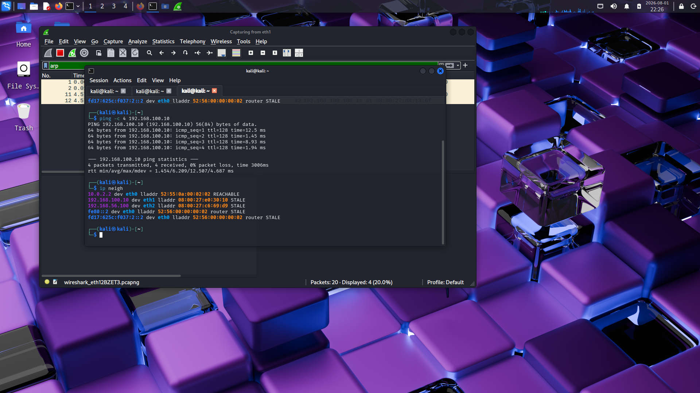

---

## Technical Interpretation

This investigation demonstrates the relationship between Layer 2 and Layer 3 communication within a local network.

Although the user initiated communication using an IPv4 address, Ethernet communication cannot begin until the destination MAC address is known.

The sequence observed during this investigation was:

1. Kali Linux attempts to communicate with **192.168.100.10**.
2. The ARP cache does not contain the destination MAC address.
3. Kali broadcasts an ARP Request to the local network.
4. The Windows Server replies with its Ethernet MAC address.
5. Kali stores the mapping in its ARP cache.
6. The ICMP Echo Request is transmitted using the resolved MAC address.
7. Communication proceeds normally.

Without ARP, IPv4 communication between devices located on the same subnet would not be possible because Ethernet frames require MAC addresses rather than IPv4 addresses.

The communication flow can therefore be represented as:

Kali Linux

192.168.100.100

↓

ARP Request (Broadcast)

↓

Windows Server

192.168.100.10

↓

ARP Reply

↓

ARP Cache Updated

↓

ICMP Echo Request

↓

ICMP Echo Reply

---

## Phase 5 Conclusion

The Address Resolution Protocol was successfully investigated within the isolated laboratory network.

Wireshark captured both the ARP Request and ARP Reply exchanged between Kali Linux and the Windows Server, demonstrating how Layer 2 address resolution occurs before IPv4 communication begins.

Verification of the ARP cache confirmed that Kali Linux dynamically learned and stored the Windows Server's Ethernet MAC address after the exchange.

This phase establishes the critical relationship between Ethernet addressing and IPv4 communication, providing the foundation for the subsequent analysis of packet flow and routing behaviour within the network.
