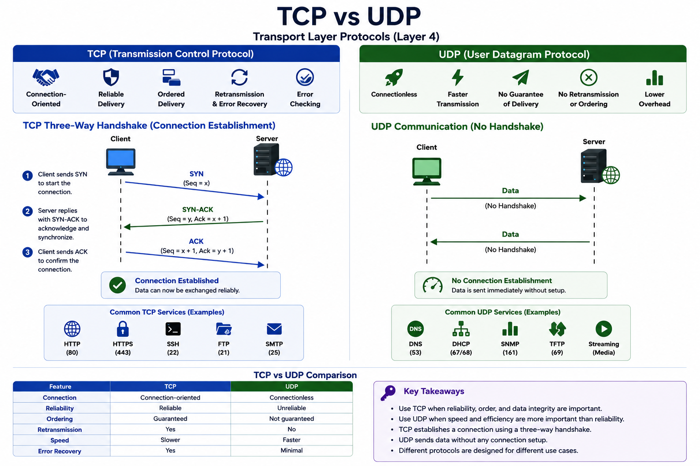

# TCP vs UDP

## Introduction

TCP (Transmission Control Protocol) and UDP (User Datagram Protocol) are two transport-layer protocols used to send data between devices.

They operate at:

```text
Layer 4 (Transport Layer)
```

Although both are used for communication, they function differently.

In penetration testing, understanding TCP and UDP is essential because they affect scanning, service detection, and exploitation.

---

## What is TCP?

TCP is a **connection-oriented** protocol.

Before communication starts, a connection must be established.

TCP provides:

- reliable delivery
- ordered delivery
- retransmission
- error checking

This makes TCP more stable.

Common TCP services:

```text
HTTP (80)
HTTPS (443)
SSH (22)
FTP (21)
```

---

## What is UDP?

UDP is a **connectionless** protocol.

Data is sent immediately without setting up a connection.

UDP provides:

- faster communication
- lower overhead

But it does not guarantee:

- delivery
- order
- retransmission

Common UDP services:

```text
DNS (53)
DHCP (67/68)
SNMP (161)
TFTP (69)
```

---

## TCP Three-Way Handshake

TCP establishes a connection using:

```text
SYN → SYN-ACK → ACK
```

### Step 1: SYN

The client sends:

```text
SYN
```

to start communication.

---

### Step 2: SYN-ACK

The server replies:

```text
SYN-ACK
```

This acknowledges the request and synchronizes communication.

---

### Step 3: ACK

The client sends:

```text
ACK
```

This confirms the connection.

The session is now established.

---

## Diagram: TCP Handshake and UDP Flow



---

## TCP vs UDP Comparison

| Feature | TCP | UDP |
|---|---|---|
| Connection | Connection-oriented | Connectionless |
| Reliability | Reliable | Unreliable |
| Speed | Slower | Faster |
| Ordering | Guaranteed | Not guaranteed |
| Retransmission | Yes | No |
| Error Recovery | Yes | Minimal |

This determines which protocol is used in different scenarios.

---

## When TCP is Used

TCP is preferred when reliability is important.

Examples:

- web browsing
- file transfer
- email
- SSH

Loss of data is unacceptable.

---

## When UDP is Used

UDP is preferred when speed is important.

Examples:

- streaming
- voice calls
- gaming
- DNS queries

Small losses are acceptable.

---

## Security Relevance

TCP and UDP are important in penetration testing.

TCP:

- SYN scanning
- service enumeration
- banner grabbing

UDP:

- DNS enumeration
- SNMP enumeration
- amplification attacks

Different protocols require different testing methods.

---

## Key Takeaways

- TCP is connection-oriented and reliable.
- UDP is connectionless and faster.
- TCP uses the three-way handshake.
- UDP sends data without setup.
- Different protocols serve different purposes.

---

## Conclusion

TCP and UDP are essential transport protocols that support modern network communication.

For penetration testers, understanding their behavior is critical because it directly affects scanning, enumeration, and exploitation strategies.
